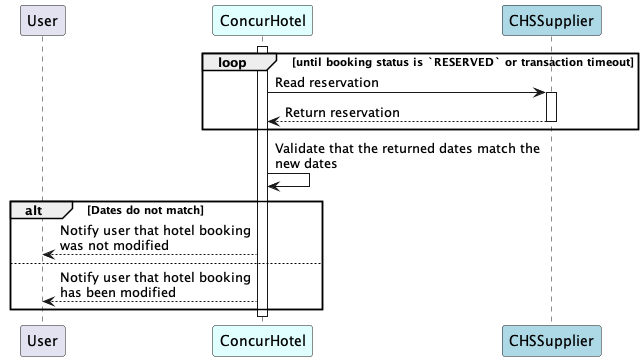

# Hotel Modify Support For CHS



## Overview

This document describes the workflow that will be used if a CHS supplier wants to implement support for modifying hotel booking. As of now, SAP Concur supports only modification of dates with possibility of changing other attributes in the future. The supplier can choose to support this feature by implementing the Hotel Service [v4 `modify` endpoint](./v4.endpoints.html#modify-). 

## Workflow

At a high-level, the workflow consists of:

- If `modify` is supported by CHS supplier and booking is marked as `modifiable`, user is provided with option to change dates for hotel booking and user updates the dates (checkin/checkout/both).
- SAP Concur invokes [`rate-details`](./v4.endpoints.html#rate-details-)  (used as `reshop` request) using same `ratePlanId` as used in original booking along with `confirmationCodes` that provides all confirmation codes and pin associated with booking.
- CHS supplier provides price details for the new dates based on confirmation codes and/or original `ratePlanId`. Hotel room/product is expected to be the same as original booking. Note that `ratePlanId` in response can be different from original booking.
- SAP Concur UI presents change in cost and new pricing to user for review. 
- User accepts and confirms the change request. 
- SAP Concur invokes [modify](./v4.endpoints.html#modify-) endpoint with new dates and `ratePlanId` from previous response along with confirmation codes and pin.
- CHS supplier updates the booking with new dates and returns the updated booking details.

Below is the sequence diagram for the flow:

## Modify Recovery Process

In the case of a request timed out, SAP Concur will start a recovery process, in wich SAP Concur will try to confirm the status of the booking.
Also if the supplier identifies that the modification cannot be confirmed in a timely manner, it can return a `PENDING_CONFIRMATION` status in the response to the [modify](./v4.endpoints.html#modify-) request. In this case SAP Concur will also start a recovery process to confirm the status of the booking.

In the process of recovery, SAP Concur will invoke the [read](./v4.endpoints.html#read-) endpoint to get the state of the modified booking. If the returned booking have a `RESERVED` status and have the new dates requested by the user, then the booking is marked as confirmed. If the returned booking have a `PENDING_CONFIRMATION` status, SAP Concur will continue to invoke the [read](./v4.endpoints.html#read-) endpoint until the endpoint return a booking with status `RESERVED`.
If the returned booking have status of `RESERVED` but the dates of check-in and check-out are not the same as the dates requested by the user, then SAP Concur will consider the modification as failed and will notify the user about it.

Below is the sequence diagram for the recovery flow:

## Requirements for CHS Supplier

- Supplier is expected to set [`isModifiable`](./v4.schemas.html#-hotelbooking) flag to `true` in the booking response if they support `modify` feature for a given booking.
- Supplier will need to support `reshop` request via [`rate-details`](./v4.endpoints.html#rate-details-) providing detailed pricing for new dates on already booked hotel and rate-plan.  
- Supplier will need to support `modify` request via [`modify`](./v4.endpoints.html#modify-) endpoint to update the booking with new dates.

